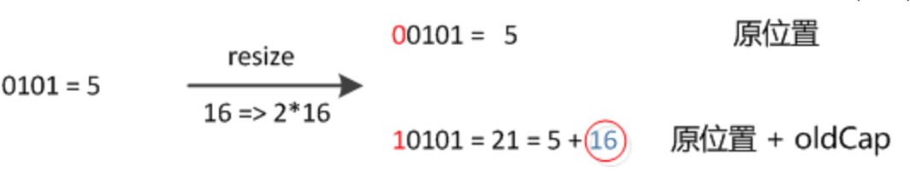

1、HashMap继承与AbstractMap类，实现了Map接口，允许键为null和值为null，是线程不安全的，内部元素是无序的，利用迭代器遍历元素的时候也会有fail\-fast机制。

2、基本参数

```java
    //必须是2的冥
    static final int DEFAULT_INITIAL_CAPACITY = 1 << 4; // aka 16
    //最大容量，2的30次方。
    static final int MAXIMUM_CAPACITY = 1 << 30;
    //加载因子，用于扩容使用。
    static final float DEFAULT_LOAD_FACTOR = 0.75f;
    //当某个桶节点数量大于8时，链表会转换为红黑树。
    static final int TREEIFY_THRESHOLD = 8;
    //当某个桶节点数量小于6时，会转换为链表，前提是它当前是红黑树结构。
    static final int UNTREEIFY_THRESHOLD = 6;
    //当整个hashMap中table数组元素数量大于64时，每个桶的节点数量超过8时，链表转为红黑树结构。
    static final int MIN_TREEIFY_CAPACITY = 64;
```
* 如果哈希表的容量小于64，即使节点的链表数量超过8也不会转化为红黑树，而是先扩容。

* 2的整数次幂,这样做的好处是，length\-1正好是低x位均为1，起到一个掩码的作用，而掩码的作用与求余相同。如初始长度16，\-1后的二进制为1111，和hash值进行与操作，相当于hash值对16求余。这个求余操作用于将hash值映射到Node数组的空间中，在寻找key对应的bucket时，只需要table\[\(length\-1\) & hash\(key\)\]即可，然后遍历其指向的链表即可找到K/V对。

3、加载因子load factor一般不需要改变默认值，这是控制数组存放数据疏密程度，越接近1存放的数据就越多越密，也会让链表长度增加，相反越接近0数据就越少越稀疏。如果加载因子太大，数组每个位置上的元素就越多，根据key查找value的时候就得通过equals函数依次比较链表中的元素，对性能影响大；如果太小，数据太稀疏，浪费很多空间。

4、HashMap的数据结构Node和存储模型：


5、存放元素的过程：通过key、value封装成一个Node对象，然后通过key的值来计算该Node的hash值，通过Node的hash值和数组的长度length来计算出Node放在数组中的哪个位置上面，每次存放都是将Node放在第一个位置。还需要判断数组长度和链表长度决定是否需要转换成红黑树的结构。

6、hash算法（JDK1.8）

```java
static final int hash(Object key) {
        int h;
        return (key == null) ? 0 : (h = key.hashCode()) ^ (h >>> 16);
    }
```
直接使用key的hashcode\(\)作为hash很容易发生碰撞；而且低位可能出现规律性重复，hashcode的高16位在计算索引中是用不到的，所以从速度、实用性等方面考虑，使key的hashcode\(\)高16位不变，低16位与高16位异或作为最终hash值，混合了原始哈希码的高位和低位，加大了低位的随机性，可以在数组table的length比较小的时候，也能保证考虑到高低Bit都参与到Hash的计算中，同时不会有太大的开销。

7、拉链法解决冲突：创建一个链表数组，数组每一格就是一个链表，遇到哈希冲突则将冲突的值加到链表中。

1\.8改进：当链表长度大于8时，链表会转化成红黑树，以减少搜索时间。

8、tableSizeFor\(\)方法返回大于输入参数的第一个是2的冥的数,这个方法被调用的地方是在一个构造函数中，当传入一个初始容量时，会调用 `this.threshold = tableSizeFor(initialCapacity)` 计算扩容阈值。

```java
static final int tableSizeFor(int cap) {
        int n = cap - 1;
        n |= n >>> 1;
        n |= n >>> 2;
        n |= n >>> 4;
        n |= n >>> 8;
        n |= n >>> 16;
        return (n < 0) ? 1 : (n >= MAXIMUM_CAPACITY) ? MAXIMUM_CAPACITY : n + 1;
    }
```


9、put方法的执行流程：


get方法比较简单，通过hash定位桶，然后根据存储结构决定是遍历树还是链表。

10、链表转树的方法：

```java
final void treeifyBin(Node<K,V>[] tab, int hash) {
        int n, index; Node<K,V> e;
        //如果数组为null或者容量是小于64，先扩容
        if (tab == null || (n = tab.length) < MIN_TREEIFY_CAPACITY)
            resize();
        //否则转化成红黑树
        else if ((e = tab[index = (n - 1) & hash]) != null) {
            TreeNode<K,V> hd = null, tl = null;
            do {
                TreeNode<K,V> p = replacementTreeNode(e, null);
                if (tl == null)
                    hd = p;
                else {
                    p.prev = tl;
                    tl.next = p;
                }
                tl = p;
            } while ((e = e.next) != null);
            //构造红黑树
            if ((tab[index] = hd) != null)
                hd.treeify(tab);
        }
    }
```
11、扩容方法

```java
final Node<K,V>[] resize() {
        //把扩容前的数组复制
        Node<K,V>[] oldTab = table;
        int oldCap = (oldTab == null) ? 0 : oldTab.length;
        //threshold是扩容的临界点，=capacity*loadfactor
        int oldThr = threshold;
        int newCap, newThr = 0;
        if (oldCap > 0) {
            //如果已经到达最大容量了，就不再扩容，直接返回
            if (oldCap >= MAXIMUM_CAPACITY) {
                threshold = Integer.MAX_VALUE;
                return oldTab;
            }
            //没超过最大值就扩容2倍
            else if ((newCap = oldCap << 1) < MAXIMUM_CAPACITY &&
                     oldCap >= DEFAULT_INITIAL_CAPACITY)
                newThr = oldThr << 1; // double threshold
        }
        
        else if (oldThr > 0) // initial capacity was placed in threshold
            newCap = oldThr;
        else {               // zero initial threshold signifies using defaults
            newCap = DEFAULT_INITIAL_CAPACITY;
            newThr = (int)(DEFAULT_LOAD_FACTOR * DEFAULT_INITIAL_CAPACITY);
        }
        if (newThr == 0) {
            float ft = (float)newCap * loadFactor;
            newThr = (newCap < MAXIMUM_CAPACITY && ft < (float)MAXIMUM_CAPACITY ?
                      (int)ft : Integer.MAX_VALUE);
        }
        threshold = newThr;
        @SuppressWarnings({"rawtypes","unchecked"})
            Node<K,V>[] newTab = (Node<K,V>[])new Node[newCap];
        table = newTab;
        if (oldTab != null) {
            //遍历每个桶，移动旧桶的元素到新的桶
            for (int j = 0; j < oldCap; ++j) {
                Node<K,V> e;
                if ((e = oldTab[j]) != null) {
                    oldTab[j] = null;
                    //如果桶只有一个元素，直接散列定位保存
                    if (e.next == null)
                        newTab[e.hash & (newCap - 1)] = e;
                    //重构红黑树
                    else if (e instanceof TreeNode)
                        ((TreeNode<K,V>)e).split(this, newTab, j, oldCap);
                    else { // preserve order
                        Node<K,V> loHead = null, loTail = null;
                        Node<K,V> hiHead = null, hiTail = null;
                        Node<K,V> next;
                        do {
                            next = e.next;
                            if ((e.hash & oldCap) == 0) {
                                if (loTail == null)
                                    loHead = e;
                                else
                                    loTail.next = e;
                                loTail = e;
                            }
                            else {
                                if (hiTail == null)
                                    hiHead = e;
                                else
                                    hiTail.next = e;
                                hiTail = e;
                            }
                        } while ((e = next) != null);
                        //放到扩容后新桶的原索引处
                        if (loTail != null) {
                            loTail.next = null;
                            newTab[j] = loHead;
                        }
                        //放到扩容后新桶的 原索引+oldCap 处
                        if (hiTail != null) {
                            hiTail.next = null;
                            newTab[j + oldCap] = hiHead;
                        }
                    }
                }
            }
        }
        return newTab;
    }
```
在JDK1.8中我们可以发现，我们使用的是2次幂的扩展\(指长度扩为原来2倍\)，所以，元素的位置要么是在原位置，要么是在原位置再移动2次幂的位置。看下图可以明白这句话的意思，n为table的长度，图（a）表示扩容前的key1和key2两种key确定索引位置的示例，图（b）表示扩容后key1和key2两种key确定索引位置的示例，其中hash1是key1对应的哈希与高位运算结果。


元素在重新计算hash之后，因为n变为2倍，那么n\-1的mask范围在高位多1bit\(红色\)，因此新的index就会发生这样的变化：




因此，我们在扩充HashMap的时候，不需要像JDK1.7的实现那样重新计算hash，只需要看看原来的hash值新增的那个bit是1还是0就好了，是0的话索引没变，是1的话索引变成 原索引\+oldCap。

12、为什么获取下标的时候使用位运算的原因：效率；处理负数更方便，因为length\-1是正数，高位为0，与操作之后的高位一定是0，也就是得到的是一个正数。

13、线程不安全的问题：

* 多线程下put操作会导致丢失数据的问题：
> 比如有两个线程A和B，首先A希望插入一个key\-value对到HashMap中，首先计算记录所要落到的 hash桶的索引坐标，然后获取到该桶里面的链表头结点，此时线程A的时间片用完了，而此时线程B被调度得以执行，和线程A一样执行，只不过线程B成功将记录插到了桶里面，假设线程A插入的记录计算出来的 hash桶索引和线程B要插入的记录计算出来的 hash桶索引是一样的，那么当线程B成功插入之后，线程A再次被调度运行时，它依然持有过期的链表头但是它对此一无所知，以至于它认为它应该这样做，如此一来就覆盖了线程B插入的记录，这样线程B插入的记录就凭空消失了，造成了数据不一致的行为。

* JDK1\.7版本的resize\(\)有死循环的问题
> 因为扩容之后链表重组用的是头插法，多线程下会出现死循环。1.8版本链表重组是直接将元素添加到表尾。

### 部分参考：

[https://itimetraveler.github.io/2018/07/19/%E3%80%90Java%E3%80%91J.U.C%E5%B9%B6%E5%8F%91%E5%8C%85%20\-%20AQS%E6%9C%BA%E5%88%B6/](https://itimetraveler.github.io/2018/07/19/【Java】J.U.C并发包%20-%20AQS机制/)
