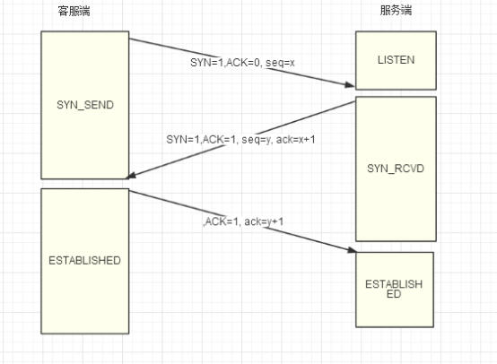
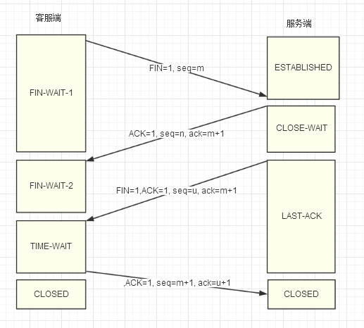

## 1、UDP和TCP区别

1、UDP（用户数据报协议）是无连接的，不可靠的，尽可能大量的发送数据包，没有流量控制、拥塞避免、丢包不重传，无序
> UDP因为无连接，随时可以向对端发送数据包，且本身处理简单高效，常用于：数据包总量较少的通信（DNS、SNMP）；视频、音频等对实时性要求高的多媒体通信；广播通信、多播通信
2、TCP面向连接的，双方必须先创建连接才能发送数据，而且有一系列的方式保证传输可靠，有序

来源：[https://www.cnblogs.com/steven520213/p/8005258.html](https://www.cnblogs.com/steven520213/p/8005258.html)
## 2、TCP如何保证可靠性

TCP通过序列号、校验和、确认应答型号、重发控制、连接管理、窗口控制、流量控制、拥塞控制实现可靠性。（三次握手、四次挥手、流量控制、拥塞避免）
1、TCP是位于传输层的协议，面向连接，提供可靠传输，有流量控制、拥塞控制，是一对一的传输
* 三次握手
1、客户端先发送一个SYN给服务端，请求连接；
2、服务端回复ACK确认连接，同时也发送SYN给客户端；
3、客户端回复ACK给服务端确认连接，这样双方通过相互请求和相互确认就可以建立连接。

* 四次挥手
1、客户端发送FIN报文给服务端，请求断开连接；
2、服务端收到客户端的FIN之后，发出ACK确认，此时TCP处于半连接状态，如果服务端数据还没发送完毕可以继续向客户端发送，客户端只能接收不能发送；
3、当服务端数据发送完毕之后向客户端发送FIN报文，通知客户端数据已经发送完毕可以完全关闭连接
4、客户端回复ACK给服务端确认关闭连接

* 可靠传输
超时重传
* 流量控制 
滑动窗口
* 拥塞控制
四种方式：慢开始，拥塞避免，快重传，快恢复
需要维护一个拥塞窗口cwnd的状态量
   * 慢开始与拥塞避免
   > 一开始令cwnd=1，发送方只发送一个报文，收到确认后，cwnd加倍；为了避免网络拥塞，需要给cwnd设定一个限定值ssthresh，超过限定值之后每次只增加1个，也就是进入拥塞避免。如果出现超时，ssthresh=cwnd/2，重新执行慢开始
   * 快重传与快恢复
   > 接收方收到的每一个报文需要对每一个报文发送确认，如果发送方连续收到三个相同的确认，则立即重传下一个报文；在这种丢失个别报文的情况下，执行快恢复，令ssthresh=cwnd/2，cwnd=ssthresh，此时是直接进入拥塞避免

来源：[https://blog.csdn.net/cmm0401/article/details/77878998](https://blog.csdn.net/cmm0401/article/details/77878998)
## 3、为什么要三次握手四次挥手？

三次握手是为了建立可靠连接，防止已经失效的连接请求突然到达造成错误。
四次挥手是为了保证完成数据传输。
## 4、为什么状态还需要等2MSL后才能返回到CLOSED状态？

1、MSL是指报文在网络上最长存活时间，这是因为虽然双方都同意关闭连接了，而且握手的4个报文也都协调和发送完毕，按理可以直接回到CLOSED状态（就好比从状态到状态那样）；但是因为我们必须要假想网络是不可靠的，你无法保证你最后发送的ACK报文会一定被对方收到，因此对方处于状态下的可能会因为超时未收到报文，而重发报文，所以这个状态的作用就是用来重发可能丢失的报文。
2、关闭这个链接，过一段时间后在 相同的IP地址和端口建立另一个连接。后一个链接成为前一个的化身。因为它们的IP地址和端口号都相同。TCP必须防止来自某一个连接的老的重复分组在连 接已经终止后再现，从而被误解成属于同一链接的某一个某一个新的化身。为做到这一点，TCP将不给处于TIME\_WAIT状态的链接发起新的化身。既然 TIME\_WAIT状态的持续时间是MSL的2倍，这就足以让某个方向上的分组最多存活msl秒即被丢弃，另一个方向上的应答最多存活msl秒也被丢弃。 通过实施这个规则，我们就能保证每成功建立一个TCP连接时。来自该链接先前化身的重复分组都已经在网络中消逝了。