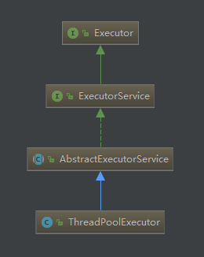

## 1、继承关系

ThreadPoolExecutor继承于AbstractExecutorService\-\-\>ExecutorService\-\-\>Executor


## 2、线程池状态

1、用一个int类型表示，共32位，前三位表示线程池状态，后29位表示线程数量，线程池的状态有：

* RUNNING：接受新任务并且处理阻塞队列里的任务
* SHUTDOWN：拒绝新任务但是处理阻塞队列里的任务
* STOP：拒绝新任务并且抛弃阻塞队列里的任务同时会中断正在处理的任务
* TIDYING：所有任务都执行完（包含阻塞队列里面任务）当前线程池活动线程为0，将要调用terminated方法
* TERMINATED：终止状态。terminated方法调用完成以后的状态

2、各种状态之间的转换

* RUNNING \-\> SHUTDOWN
显式调用shutdown\(\)方法，或者隐式调用了finalize\(\),它里面调用了shutdown（）方法。
* RUNNING or SHUTDOWN\)\-\> STOP
显式 shutdownNow\(\)方法
* SHUTDOWN \-\> TIDYING
当线程池和任务队列都为空的时候
* STOP \-\> TIDYING
当线程池为空的时候
* TIDYING \-\> TERMINATED
当 terminated\(\) hook 方法执行完成时候

## 3、构造函数

有四个构造函数，其他三个都是调用以下这个：

```java
public ThreadPoolExecutor(int corePoolSize,
                              int maximumPoolSize,
                              long keepAliveTime,
                              TimeUnit unit,
                              BlockingQueue<Runnable> workQueue,
                              ThreadFactory threadFactory,
                              RejectedExecutionHandler handler) 
```
* corePoolSize：线程池核心线程个数
* workQueue：用于保存等待执行的任务的阻塞队列
* maximunPoolSize：线程池最大线程数量
* keepAliveTime：线程的存活时间。当线程池里的线程数大于corePoolSize时，如果等了keepAliveTime时长还没有任务可执行，则线程退出
* ThreadFactory：创建线程的工厂，主要是为了给线程起名字，默认工厂的线程名字：pool\-1\-thread\-3
* TimeUnit：存活时间的时间单位
* RejectedExecutionHandler：饱和策略，当队列满了并且线程个数达到maximunPoolSize后采取的策略

   * AbortPolicy：直接抛出 `RejectedExecutionException` 异常；

   * CallerRunsPolicy：使用调用者所在线程来运行任务；

   * DiscardOldestPolicy：调用poll丢弃队列里面最老的（队尾）任务，执行当前任务；

   * DiscardPolicy：默默丢弃,不抛出异常。

## 4、执行过程

1、如果当前线程池线程个数小于corePoolSize则调用addWorker开启新线程；否则添加任务到任务队列；如果任务队列满了，则尝试调用addWorker新开启线程执行任务，如果线程个数\>maximumPoolSize则执行拒绝策略。

2、addWorker方法

```java
private boolean addWorker(Runnable firstTask, boolean core) {
   retry:
   for (;;) {
       int c = ctl.get();
       int rs = runStateOf(c);

       // 检查队列是否只在必要时为空.（1）
       if (rs >= SHUTDOWN &&
           ! (rs == SHUTDOWN &&
              firstTask == null &&
              ! workQueue.isEmpty()))
           return false;

       //循环cas增加线程个数
       for (;;) {
           int wc = workerCountOf(c);

           //如果线程个数超限则返回false
           if (wc >= CAPACITY ||
               wc >= (core ? corePoolSize : maximumPoolSize))
               return false;
           //cas增加线程个数，同时只有一个线程成功
           if (compareAndIncrementWorkerCount(c))
               break retry;
           //cas失败了，则看线程池状态是否变化了，变化则跳到外层循环重试重新获取线程池状态，否者内层循环重新cas。
           c = ctl.get();  // Re-read ctl
           if (runStateOf(c) != rs)
               continue retry;
       }
   }

   //到这里说明cas成功了，（2）
   boolean workerStarted = false;
   boolean workerAdded = false;
   Worker w = null;
   try {
       //创建worker
       final ReentrantLock mainLock = this.mainLock;
       w = new Worker(firstTask);
       final Thread t = w.thread;
       if (t != null) {

           //加独占锁，为了workers同步，因为可能多个线程调用了线程池的execute方法。
           mainLock.lock();
           try {
               
               //重新检查线程池状态，为了避免在获取锁前调用了shutdown接口(3)
               int c = ctl.get();
               int rs = runStateOf(c);

               if (rs < SHUTDOWN ||
                   (rs == SHUTDOWN && firstTask == null)) {
                   if (t.isAlive()) // precheck that t is startable
                       throw new IllegalThreadStateException();
                   //添加任务
                   workers.add(w);
                   int s = workers.size();
                   if (s > largestPoolSize)
                       largestPoolSize = s;
                   workerAdded = true;
               }
           } finally {
               mainLock.unlock();
           }
           //添加成功则启动任务
           if (workerAdded) {
               t.start();
               workerStarted = true;
           }
       }
   } finally {
       if (! workerStarted)
           addWorkerFailed(w);
   }
   return workerStarted;
}
```
3、工作线程Worker的执行

```java
Worker(Runnable firstTask) {
   setState(-1); // 在调用runWorker前禁止中断
   this.firstTask = firstTask;
   this.thread = getThreadFactory().newThread(this);//创建一个线程
}
```
4、调用shutdown后，线程池就不会在接受新的任务了，但是工作队列里面的任务还是要执行的，但是该方法立刻返回的，并不等待队列任务完成在返回。调用awaitTermination完成队列里面的任务的处理

5、通过线程池状态来控制任务的执行，每个worker线程可以处理多个任务，线程池通过线程的复用减少了线程创建和销毁的开销，通过使用任务队列避免了线程的阻塞从而避免了线程调度和线程上下文切换的开销。


部分来源：
[Java中线程池ThreadPoolExecutor原理探究](http://ifeve.com/java%E4%B8%AD%E7%BA%BF%E7%A8%8B%E6%B1%A0threadpoolexecutor%E5%8E%9F%E7%90%86%E6%8E%A2%E7%A9%B6/)


